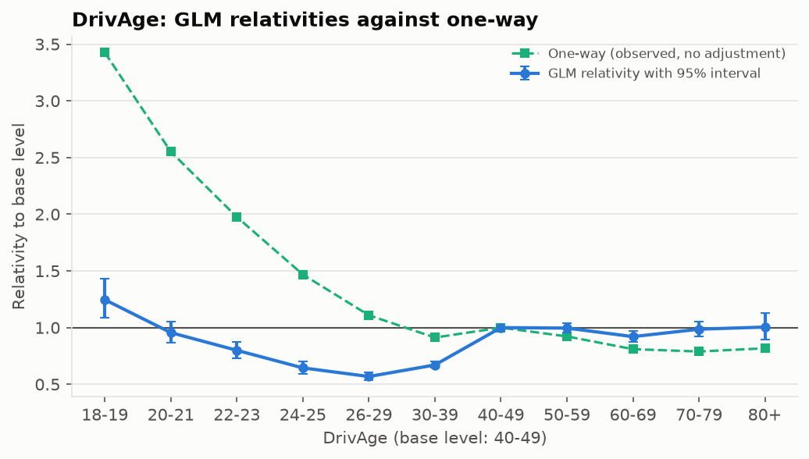
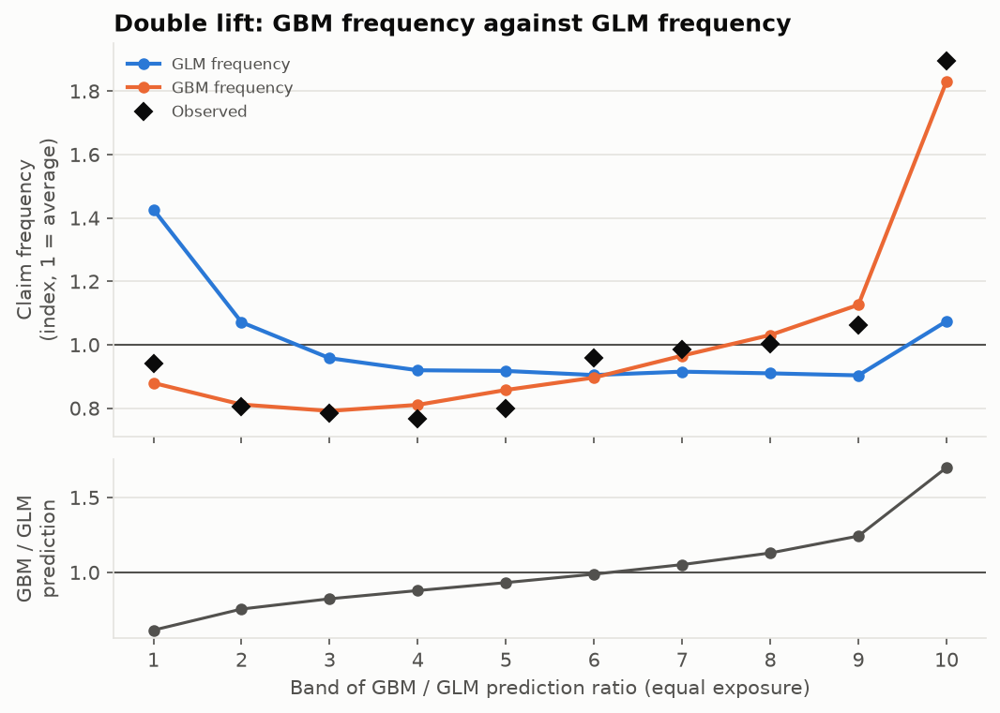
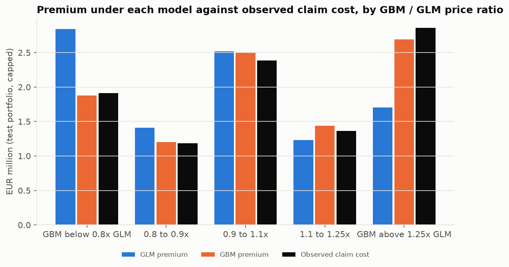
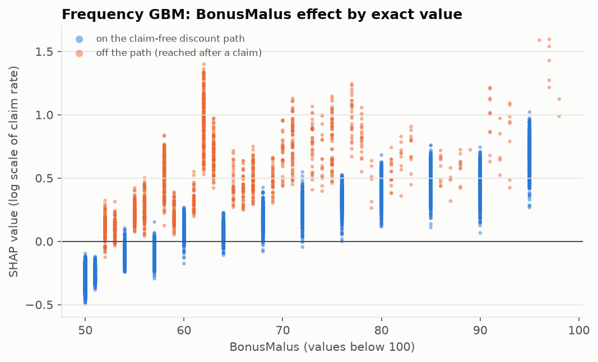

# Motor Insurance Pricing Model

[](https://github.com/liamhavers/motor-pricing-model/actions/workflows/ci.yml)

Predicting how often a motor policyholder will claim and how much those claims will cost, turning that into a price, and working out what it would mean commercially to price with a gradient-boosted model (LightGBM) instead of the traditional GLM.

Built on the French motor third-party liability data (freMTPL2, about 678,000 policies) as a portfolio project for insurance pricing roles.

## Summary

An insurer needs to charge each customer enough to cover the claims they are likely to make, and not so much that they take their business elsewhere. The part of the price that covers expected claims is the **pure premium**. This project builds it in the standard way, as **how often a policy claims** (frequency) multiplied by **how much each claim costs** (severity), and compares two kinds of model for each part:

- a **GLM** (generalised linear model), the industry standard, which produces a simple rating table of multipliers such as "drivers aged 18 to 19: x1.25";
- a **GBM** (gradient-boosted trees), which is more flexible and usually more accurate, but harder to explain.

Every choice is made on training data and each model is scored once on a held-out test set of 135,000 policies. The comparison goes beyond accuracy scores to the question a pricing team would ask: if we priced with the GBM instead of the GLM, which customers would we be undercharging or overcharging today, and what would that cost?

## Key findings

All figures are on the held-out test set of 135,603 policies, with claims capped at EUR 50,000.

- **Almost all of the difference between customers comes from how often they claim, not how much their claims cost.** Once large claims are capped, neither severity model predicted claim cost reliably better than a single average. The frequency models did the work.
- **The GBM ranks risk better than the GLM, and the gap is not down to chance.** On pure premium its Gini is 0.354 against the GLM's 0.311, and the 95% interval for the difference (0.025 to 0.063) excludes zero. The same holds for frequency on its own.
- **Pricing with the GBM would move about 13% of premium between customers.** With both models charging the same total, about EUR 1.25m of the test portfolio's EUR 9.7m would shift. The customers the GLM undercharges paid EUR 2.9m and claimed EUR 4.2m, a shortfall of about EUR 1.3m. The customers it overcharges paid EUR 4.3m and claimed EUR 3.1m, and are the ones most likely to leave for a competitor.
- **Actual claims followed the GBM's prices where the two models disagreed.** Where the GBM priced about 1.7 times higher than the GLM, claims came in at 1.9 times the average; the GBM predicted 1.8 and the GLM 1.1.
- **The undercharged and overcharged customers can be described.** The GLM undercharges customers who have claimed recently, and drivers under 50 on the maximum no-claims discount with newer cars, whose claims came to 1.35 times their GLM premium. It overcharges claim-free customers at BonusMalus 51 to 54, customers at BonusMalus 100 or above with newer cars (claims 0.75 times their GLM premium) and, more often than average, drivers aged 70 and over.
- **Most of the GBM's advantage comes from one pattern, and the GLM can learn it.** The GBM found, from the data alone, that a BonusMalus value off the claim-free discount path means a recent claim. Adding that single flag to the GLM (a relativity of 2.4) closed about half of the gap between the two models.
- **Large losses are a pricing problem in their own right.** Claims over EUR 50,000 were 0.3% of claims but 24% of cost, and the loading to cover them moved from about 20% to 31% because of a single EUR 4.1m claim.

## Recommendation

I would not replace the GLM with the GBM outright. The GBM is more accurate, but the GLM's rating table is what makes prices easy to explain to customers, underwriters and the regulator, simple to govern and monitor, and straightforward to test for unfair outcomes.

Instead I would keep the GLM as the base price and add a GBM adjustment on top, capped so that it can only move any one customer's price by a limited amount. The GLM would still set most of each price, the part that is harder to explain would be bounded, and the business would capture more of the GBM's better risk ranking. As a first step, the off-discount-path flag should go into the GLM directly: it closes about half the gap on its own and keeps the GLM's rating-table form.

Before any change went live, I would want three things that this project could not provide:

- validation on a later year of data, since these results come from a single period;
- testing of outcomes by customer group, to check that neither the flag nor the GBM adjustment acts as a proxy for a protected characteristic;
- price and conversion data, to estimate how customers would respond to the changes and what losing overcharged customers would cost.

## The problem

A motor insurer pricing third-party liability cover needs, for every customer, an estimate of the claims they will cost over the year. That estimate has two parts that behave very differently:

- **Frequency**: most policies (96% here) have no claim in a year. The question is how the chance of a claim varies with the driver, the car and where it is kept.
- **Severity**: when a claim happens, its cost varies enormously, from a few hundred euros to several million.

The price then has to account for the fact that most policies were not on risk for a full year, that a handful of very large claims dominate the total, and that the model has to be explained to underwriters, managers and regulators.

## The data

Two public French datasets from OpenML, joined on policy ID:

- **freMTPL2freq**: one row per policy, with exposure (the fraction of a year on risk), claim count and nine rating factors: driver age, vehicle age, vehicle power, vehicle brand, fuel type, BonusMalus (the French no-claims discount level, where 50 is the best and 100 is a new driver), population density, area and region.
- **freMTPL2sev**: one row per claim, with its cost.

Cleaning decisions, all counted and explained in the [EDA notebook](notebooks/01_eda.ipynb):

- About 9,100 policies record claims with no cost in the severity table. Their claim count is set to zero so that the frequency and cost models describe the same claims. This lowers observed frequency and is listed as a limitation.
- Exposure is capped at one year (1,224 policies above) and claim counts at four (9 policies above, several with 9 to 16 claims in a few weeks).
- Individual claims are capped at EUR 50,000 before modelling (see below).

## Approach

The data is split once, 80% for training and 20% for testing, by policy. Every modelling choice (banding, factor selection, model settings) is made on the training data using cross-validation. The test set is scored once, after all models are fixed, and every later analysis reuses those frozen predictions.

**Frequency** ([notebook](notebooks/02_frequency.ipynb)). A Poisson GLM on banded rating factors, with the log of exposure as an offset so that the model predicts claims per year and scales it by time on risk. The GBM uses the raw factors and includes exposure in the same way. The GLM's relativities show why models are fitted on all factors at once: on its own, driver age suggests 18 to 19 year olds claim 3.4 times as often as drivers in their 40s; after allowing for BonusMalus, the difference is 1.25 times.



**Severity** ([notebook](notebooks/03_severity.ipynb)). A Gamma GLM on the average capped cost per claim, weighted by the number of claims. Claims are capped at EUR 50,000: that affects 0.3% of claims but removes 24% of cost, and cuts the uncertainty in the average claim cost from about 10% to under 2%. The cost above the cap is added back to every price as a **large-loss loading** (about 31% of capped cost on this training data, though the estimate depends heavily on a single EUR 4.1m claim). With all rating factors the severity GLM did worse on unseen data than a single average, so factors were chosen by cross-validation: BonusMalus, driver age and density.

**Pure premium** ([notebook](notebooks/04_pure_premium.ipynb)). Frequency multiplied by severity, compared with a single **Tweedie** model of cost per year, which handles the mix of zero-cost policies and skewed claim amounts in one distribution. The Tweedie power, 1.8, comes from the shape of our own claim costs and was checked on validation data. Boosting with a Tweedie loss systematically under-predicts the overall level, so the Tweedie GBM is rebased to the training total.

**Evaluation** ([notebook](notebooks/05_evaluation.ipynb)) and **commercial analysis** ([notebook](notebooks/06_commercial_analysis.ipynb)) are described under Results.

## Results

All figures are on the test set. Deviance measures fit in the way that suits each kind of data (lower is better); "vs no factors" is the improvement over charging everyone the training average; the Gini measures how well a model ranks customers from cheapest to most expensive (0 is random); balance is total predicted over total actual.

| Stage | Model | Deviance | vs no factors | Gini | Balance |
|---|---|---|---|---|---|
| Frequency (Poisson) | GLM | 0.4625 | 4.8% | 0.293 | 0.97 |
| | GBM | 0.4543 | 6.5% | 0.326 | 0.97 |
| Severity (Gamma) | GLM | 1.2449 | -0.6% | 0.014 | 0.97 |
| | GBM | 1.2346 | 0.3% | 0.037 | 0.95 |
| Pure premium (Tweedie 1.8) | GLM frequency x severity | 29.92 | 2.7% | 0.311 | 0.94 |
| | GBM frequency x severity | 29.61 | 3.7% | 0.354 | 0.92 |
| | GLM Tweedie | 29.93 | 2.7% | 0.317 | 0.96 |
| | GBM Tweedie | 29.78 | 3.2% | 0.330 | 0.95 |

Balance is below 1 for every model, including charging everyone the average, because the test set happens to be about 6% more expensive than the training set. RMSE is not used: it rated the GLM, the GBM and charging everyone the average within 0.1% of each other, because more than half of the squared error came from ten policies.

**Is the difference larger than chance?** The test policies were resampled 200 times to put a 95% interval around each difference between models. For frequency and pure premium, the interval for the GBM's advantage over the GLM excludes zero. For severity it includes zero, so the two models cannot be told apart.

**Where do the models disagree?** A double-lift chart sorts customers by how much the GBM's price differs from the GLM's. Where the GBM prices highest relative to the GLM, actual claims followed the GBM.



**What is it worth?** With both models scaled to charge the same total, this is who would pay more or less under the GBM, and what their claims actually cost:



**What did the GBM find?** SHAP values break each GBM prediction into contributions from each factor. The largest difference from the GLM is in BonusMalus. The French scale falls 5% for each claim-free year from 100 (95, 90, 85, 80, 76, ... 54, 51, 50), so a value below 100 that is off that path can only be reached after a claim. The GBM learned from the data alone that these customers claim far more often; the GLM's bands of ten mix them with claim-free customers.



Adding a single "off the discount path" flag to the GLM (relativity 2.4) closes about half of the gap between the GLM and the GBM, while keeping the GLM's rating-table form.

## Regulatory context (UK)

This project uses French data, but the target roles are in UK pricing, where two sets of rules shape how a model like this could be used.

**General Insurance Pricing Practices (FCA, in force since 1 January 2022).** A firm must not charge a renewing customer more than it would charge an equivalent new customer through the same channel. This ended "price walking", where loyal customers paid progressively more than new ones. Neither model here uses tenure or price history, so the choice between them does not affect this rule directly, but any pricing built on top of them (discounts, demand-based adjustments) would have to respect it.

**Fair outcomes and protected characteristics.** Under the Equality Act 2010, sex cannot be used as a rating factor, and age can be used only where supported by relevant and reliable data. Beyond the factors themselves, firms are expected to show that their pricing does not produce unfair outcomes for groups with protected characteristics, and the Consumer Duty (from July 2023) adds a requirement that products offer fair value. Rating factors such as region or vehicle can act as proxies for characteristics that cannot be used directly, and a GBM can build such proxies out of interactions that no one chose explicitly. That makes testing outcomes by group, not just reviewing the factors, a necessary step before using either model, and a harder one for the GBM.

## Limitations

- **French data from one period.** The rating factors and the BonusMalus mechanism are French. There is no time dimension, so the models are not tested on a later year, which is how a pricing model would really be validated.
- **No price, conversion or retention data.** The analysis measures who would be over- or undercharged, but not how customers would react to a change in price. The cost of overcharging (customers leaving for competitors) and any price optimisation are out of reach.
- **Missing claim costs.** About 9,100 policies with recorded claims have no cost data. Setting their claims to zero keeps the models consistent but lowers the observed claim frequency.
- **Large losses.** Claims are capped at EUR 50,000 and the excess is spread as a flat loading estimated from one sample, where a single claim moves the loading from about 20% to 31%. A real loading would use many years of large-loss experience or a separate large-loss model.
- **Weak severity signal.** Once large losses are capped, the rating factors explain almost nothing about claim cost, so these conclusions rest almost entirely on frequency.
- **Model uncertainty.** Claim counts vary more than a Poisson model assumes (dispersion about 1.7), so the GLM's confidence intervals are about 30% too narrow. The results come from a single train/test split, and the GBMs were tuned with modest effort.
- **Pure premium only.** Expenses, commission, profit margin and reinsurance costs are not included.

## Next steps

- Validate on a later period of data before drawing any pricing conclusion.
- Test outcomes by group for fairness, including possible proxies.
- With price and conversion data, build a demand model to estimate the commercial effect of the price changes, including the cost of losing overcharged customers.
- Model large losses separately (for example a Pareto distribution above the cap) and estimate the loading over several years.
- Continue feeding GBM findings into the GLM, starting with the driver age by BonusMalus interaction.

## Reproducing the results

```bash
python -m venv .venv
source .venv/bin/activate
pip install -e ".[dev]"
pytest
```

Then run the notebooks in order, `01_eda` to `06_commercial_analysis`. The data downloads from OpenML on the first run and is cached in `data/raw/`. Each notebook saves its test-set predictions and fitted models to `data/processed/` for the next one. The later notebooks take a few minutes each, and the GLM fits need roughly 6 GB of memory. All random steps use a fixed seed.

## Project structure

```
├── data/                  # gitignored; raw data cached here on first download
├── notebooks/
│   ├── 01_eda.ipynb
│   ├── 02_frequency.ipynb
│   ├── 03_severity.ipynb
│   ├── 04_pure_premium.ipynb
│   ├── 05_evaluation.ipynb
│   └── 06_commercial_analysis.ipynb
├── src/pricing/
│   ├── data.py            # loading, cleaning, joining, capping, train/test split
│   ├── features.py        # GLM banding, GBM features, BonusMalus discount path
│   ├── glm.py             # Poisson, Gamma and Tweedie GLMs, relativities
│   ├── gbm.py             # LightGBM frequency, severity and Tweedie models
│   ├── evaluation.py      # deviance, Gini, calibration, double lift, bootstrap
│   └── plots.py
├── reports/figures/
├── tests/
└── LEARNING.md            # checkpoint questions and answers from building the project
```

**Stack:** Python 3.11+, polars, statsmodels, scikit-learn, LightGBM, shap, matplotlib, pytest.
